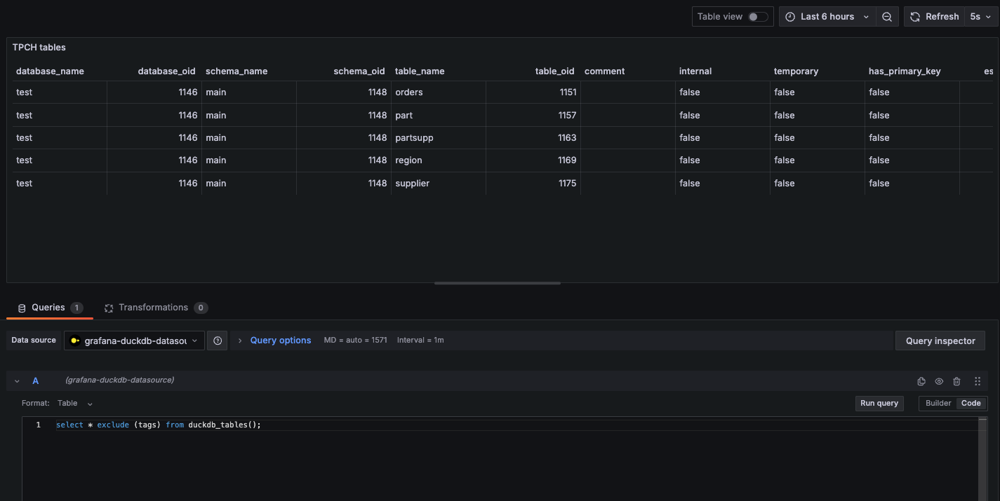

# Grafana DuckDB Data Source Plugin

The DuckDB data source plugin lets you query and visualize DuckDB data in Grafana. DuckDB is an in-process SQL OLAP database management system that provides fast analytics on local files. DuckDB's SQL dialect is derived from PostgreSQL so this plugin works similarly to the Grafana Postgres plugin and works for most SQL queries that would work in Postgres. 

The plugin is built and maintained by [MotherDuck](https://motherduck.com), a data platform that provides a cloud-based serverless DuckDB as a service, with additional features like data sharing, read scaling and more.

##  Compatibility

This plugin requires:
* Grafana Version 10.4.0 or later.
* glibc 2.35 or later (this means Ubuntu 22.04 or above)

> [!WARNING] Alpine/Musl platforms are NOT supported.
> This plugin uses [duckdb-go](https://github.com/duckdb/duckdb-go) which only provides glibc-based Linux binaries. Alpine Linux uses musl libc and is incompatible.
> **Docker users:** You must use Ubuntu-based Grafana images (`grafana/grafana:latest-ubuntu`).
> The default Grafana image is Alpine-based and will not work.


## Features

- Query editor with syntax highlighting and auto-completion.
- Import data from various file formats (CSV, Parquet, JSON) through DuckDB extensions.
- Automatically reload the DuckDB file when the file has changed, allowing for data updates via hot-swapping the file.
- Connect to and query data in MotherDuck. 

## Installation

Download the plugin for your (OS, architecture) from the [releases page](https://github.com/motherduckdb/grafana-duckdb-datasource/releases). 

Since the plugin is currently unsigned, modify the grafana.ini file to allow unsigned plugins:

```ini
...
allow_loading_unsigned_plugins = motherduck-duckdb-datasource
...

```

Then, unzip the plugin and move it to the Grafana plugins directory:


```bash
mv motherduck-duckdb-datasource-<version>.zip
unzip motherduck-duckdb-datasource-<version>.zip -d YOUR_PLUGIN_DIR/motherduck-duckdb-datasource
```

Finally, restart the Grafana server.


### Running with Docker

To run the plugin with a Grafana Docker container, you must use the Ubuntu-based Grafana image instead of the default Alpine-based one.  Use the following command to start a Grafana container with the plugin:

```bash
docker run -d \
  --name=grafana \
  -p 3000:3000 \
  -v $(pwd)/motherduck-duckdb-datasource:/var/lib/grafana/plugins/motherduck-duckdb-datasource \
  -e "GF_PLUGINS_ALLOW_LOADING_UNSIGNED_PLUGINS=motherduck-duckdb-datasource" \
  grafana/grafana:latest-ubuntu
```

This mounts your local plugin directory into the container and configures Grafana to allow loading the unsigned plugin. Remember to replace `$(pwd)/motherduck-duckdb-datasource` with the actual path to your plugin directory if needed.


## Configuration

### Data Source Options

| Name              | Description                                           | Required |
|-------------------|-------------------------------------------------------|----------|
| Path             | Path to DuckDB database file, if empty, connects to duckDB in in-memory mode.        | Yes      |
| MotherDuck Token | Token for MotherDuck API access                       | No       |

### Query Editor Options

The query editor supports standard SQL syntax and includes special Grafana macros for time range filtering and variable interpolation.

### Macros

| Macro                | Description                                        | Example |
|---------------------|----------------------------------------------------|---------|
| $__timeFilter       | Adds a time range filter using the dashboard's time range | `WHERE $__timeFilter(time_column)` |
| $__timeFrom         | Start of the dashboard time range                  | `WHERE time_column > $__timeFrom` |
| $__timeTo           | End of the dashboard time range                    | `WHERE time_column < $__timeTo` |
| $__interval         | Dashboard time range interval                      | `GROUP BY time_bucket($__interval, time_column)` |
| $__unixEpochFilter  | Time range filter for Unix timestamps              | `WHERE $__unixEpochFilter(timestamp_column)` |


## Query Examples

### Time Series Data

```sql
SELECT
  time_bucket($__interval, timestamp) AS time,
  avg(value) as average,
  max(value) as maximum
FROM metrics
WHERE $__timeFilter(timestamp)
GROUP BY 1
ORDER BY 1
```

### Table Query

```sql
SELECT
  name,
  value,
  timestamp
FROM metrics
WHERE $__timeFilter(timestamp)
LIMIT 100
```

## File Import Support

Through a rich ecosystem of extensions, DuckDB supports reading data from various file formats:

```sql
-- CSV import
SELECT * FROM read_csv_auto('path/to/file.csv');

-- Parquet import
SELECT * FROM read_parquet('path/to/file.parquet');

-- JSON import
SELECT * FROM read_json_auto('path/to/file.json');
```



## Known Issues and Suggestions for Workarounds

### Updating data in the DuckDB file
DuckDB's [concurrency support](https://duckdb.org/docs/connect/concurrency.html#handling-concurrency) does not allow multiple processes to attach the same DuckDB database file at the same time, if at least one of them requires read-write access. This means another process cannot connect to the same DuckDB database file to write to it while Grafana has it as a data source. There are a few ways to work around this:
  - Copy the DuckDB file for updates, then copy the updated DuckDB file to overwrite the original file. The plugin will automatically reload the file when it detects a change. 
  - Write to other file formats, and read using DuckDB extensions. Note that this may be much less performant than directly querying the DuckDB file.
  - Host the database using MotherDuck, which allows writing to the database while querying it from Grafana and other clients at the same time.

### Connecting to MotherDuck

If you are running the official Grafana docker image, having a DuckDB data source pointing to `md:` or `md:...` will not work due to file system permissions issues. As a workaround, leave the db path field blank, and in the `initSQL` section, add `ATTACH IF NOT EXISTS 'md:';`.

### Grafana DuckDB Plugin is not compatible with Alpine based images.

If you are starting out with the Grafana DuckDB plugin and are running into any of the following, double-check your base image:
   * error while loading shared libraries: libstdc++.so.6: cannot open shared object file: No such file or directory
   * the plugin is missing dynamic-link libraries necessary to run
   * fork/exec ...: no such file or directory

These symptoms all have the same cause: Alpine uses musl libc, not glibc. The go-duckdb binary is compiled against glibc and cannot run on musl. The "no such file or directory" error is particularly confusing because the file exists - it's the dynamic linker (/lib/ld-linux-*.so) that's missing.


## Links

- [DuckDB Documentation](https://duckdb.org/docs/)
- [Grafana Documentation](https://grafana.com/docs/)
- [MotherDuck Documentation](https://motherduck.com/docs)
- [Plugin Development Guide](https://grafana.com/docs/grafana/latest/developers/plugins/)

